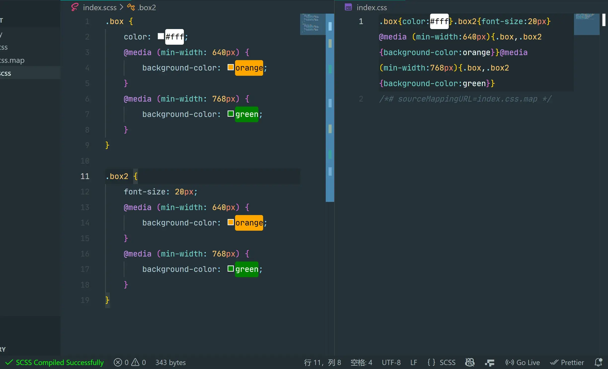

[中文文档](./README_zh-CN.md)
# SCSS to CSS Plus

Automatically compile SCSS to CSS with PostCSS (Autoprefixer) and CSSNano on save.

## Features

- **Auto Compile**: Automatically compiles `.scss` files to `.css` on save.
- **Autoprefixer**: Adds vendor prefixes to your CSS rules using values from Can I Use.
- **Media Query Merging**: Automatically merges and sorts scattered `@media` queries (mobile-first).
- **Minify**: Compresses your CSS using CSSNano.
- **Source Maps**: Generates source maps for easier debugging.
- **Partials Support**: Automatically ignores files starting with `_`.
- **Ignore Comment**: You can ignore specific files by adding `/* scss-to-css: no */` comment.

## Configuration

You can configure the following settings in your `settings.json`:

- `scssToCssPlus.autoCompile`: Enable/disable auto compilation on save (default: `true`).
- `scssToCssPlus.outDir`: Output directory for CSS files (default: `null` - same directory).
- `scssToCssPlus.generateSourceMap`: Generate source maps (default: `true`).
- `scssToCssPlus.minify`: Minify the output CSS (default: `true`).

## Usage

Just open a `.scss` file and save it! Or use the command `SCSS to CSS Plus: Compile SCSS to CSS`.

